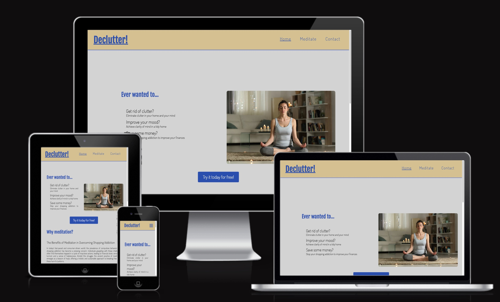
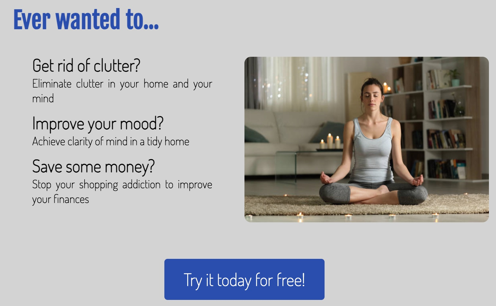
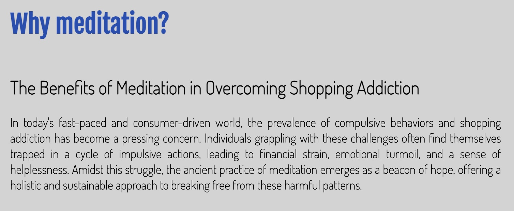
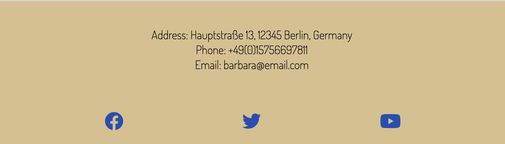
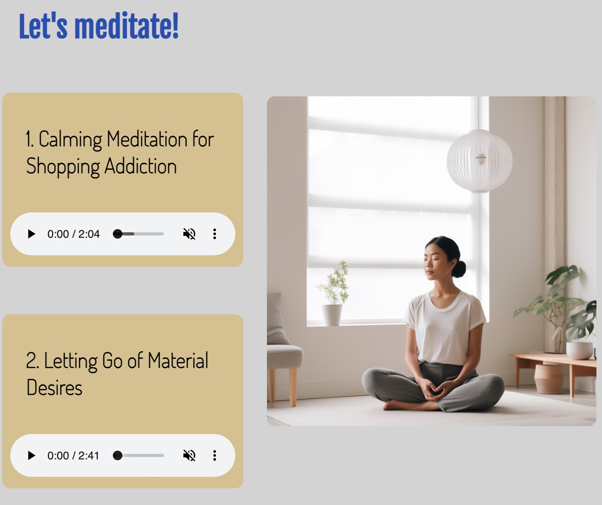
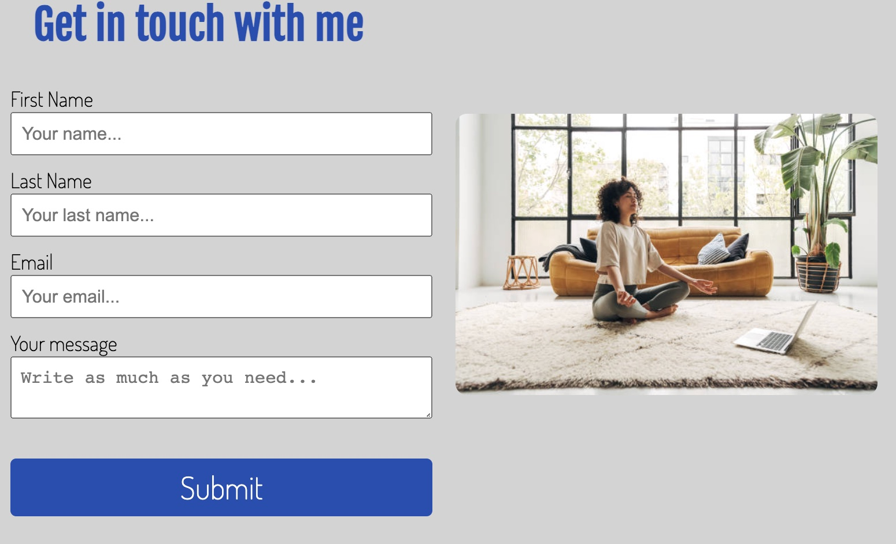
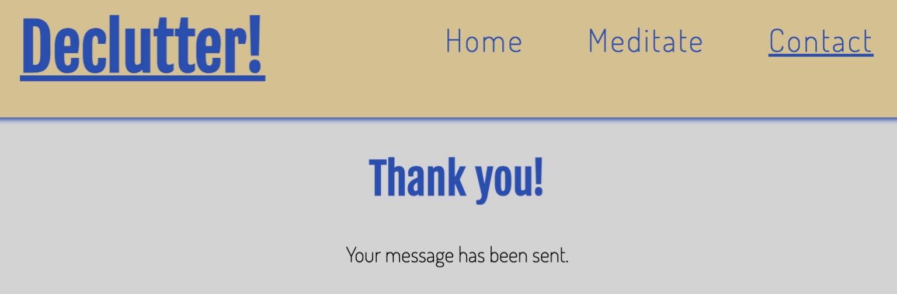
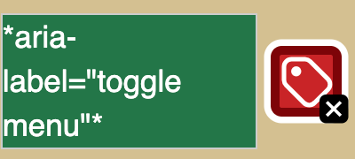
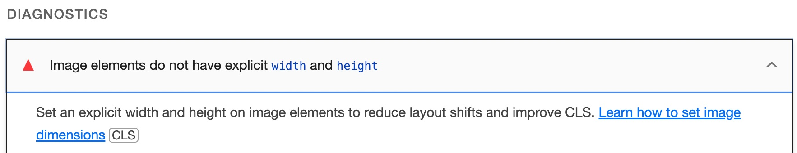
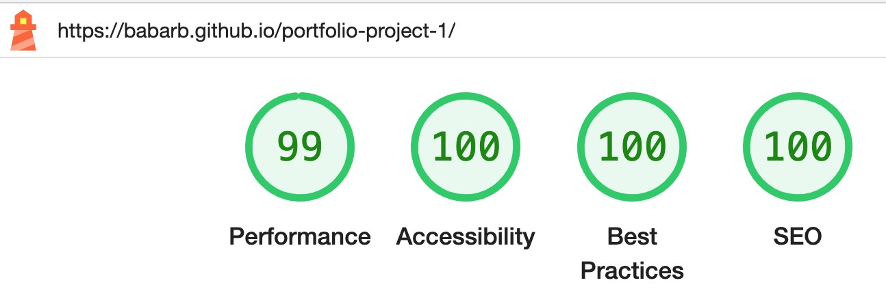

# Declutter!

Declutter! is the first rough version of a project I would like to extend in the future. The target audience is people with shopping addiction, to which the website offers meditation as a temporary solution. I have encountered people suffering from shopping addiction in my family and previous career. As regular meditator I strongly believe that this could be the answer for them.
The website was coded using the mobile first principle: following coding for mobile, a media query was added for laptop and larger screens. 

Due to time constraints I was aiming for a MVP. 

## Design
I created a basic wireframe, only for desktops. Purpose: to give me a basic idea, leaving some room for modifications later.

There have been some deviations from this wireframe due to: 

* The learning process: I learnt about features along the way that I was not aware of at the time of creating the wireframe. For example, most line breaks used at the beginning became div containers, for styling reasons and because, as I later learned, line breaks are not considered good practice.

* Some features worked better than initially planned from a user experience perspective. An example is the meditation texts and downloadable PDFs on the meditate page. Furthermore, the contact page no longer contains an "our mission" text, as too much text is generally considered bad user experience.
## Features
### Navigation bar
The navigation menu is inside the header. The site features a standard responsive navigation menu on the top right. On the top left, in line with user expectations, there is a site logo that takes the visitor back to the home page.

A link redundancy (home as well as logo both redirect users to home) can be noted here, however this is often the case with websites, including the CI Walkthrough project. Because the average website visitor often encounters such redundancy, they will come to expect it. Therefore, considering the Strategy Pane, this redundancy will positively impact the structure of the website and contribute to a better user experience.

The active page is underlined to show the visitor where they are. The hovered menu items also change colour to a theme colour of the site. The navigation is consistent on all devices, and is responsive. In mobile view, the toggling hamburger menu eliminates the need for underlined active pages.

### The Main Content
Due to the very specific audience of the site, the main page - where the service is found - is not the landing page but the meditate page. Navigation from the home page to the meditate page is therefore further facilitated by call to action buttons.

Across all pages, the main content consists of text on the left and an image on the right. It is not a background image, as its purpose is to emphasize the message of the site.
### Further readings section
Repeating on both the landing and the meditate page for consistency, this is aimed at the user willing to scroll on if they wish to learn more, or if they need the meditation scripts.

### The Footer
This contains a basic contact details section. To comply with the European and German Data Protection regulation, this could be replaced by the Privacy Policy, the Cookie Policy, and the Impressum (for Germany). The law requires that these areas are easy to find on websites. It is a UX best practice for these links to be in the footer.

Links to social media sites are located in the footer. For my own privacy, I used dummy links that open in a new window. The youtube channel, as I do not have one yet, points to my husband's channel with his permission, in case the assessors of the site fancy listening to some good music.

### Page specific features
1. Index.html

On the landing page, visitors will find information about meditation's ability to tackle shopping addiction. 

The first heading raises interest, followed by more question headings - teasers, if you like, and uses a personal, question format to identify if the site is relevant for the visitor. If the questions resonate with them, they can click the call to action button straight away to land on the "Meditate" page. Indecisive visitors can read a text with further information, after which the same call to action button repeats for their convenience (i.e. to avoid having to scroll up again). This is another example of redundancy facilitating user experience: the UX strategic pane impacting on the structural pane.

2. Meditate.html

This is the main page of the website where the actual service can be used. The meditation audios are accessible through the browser's built-in media player.

Consistency across the site is very important for good user experience. Therefore, this page has an identical structure with the home page: main text to the left, image to the right, further reading by scrolling down.

The woman in the featured image is looking towards the meditation audios, thus emphasizing them.
Hearing impaired users, or those who prefer to read the text for themselves, are able to download the scripts of the files in PDF or read the scripts directly in the browser.

3. Contact.html

Following the same content-left-picture-right structure, this page has a simple contact form to enable visitors to get in touch by email. Required fields are:
* first name: some users prefer to stay anonymous
* email address: to identify genuine users
* message block: as this is the purpose of a contact form.
  

4. Thank-you.html
   

This page does what it says on the tin: just notifies the user that the message has been sent. It has the nav menu for quick navigation back to the website.

### Features left to implement

1. Styled 404 page: a 404 is important for both human visitors and [browser bots to crawl the site correctly](https://seosly.com/blog/do-404-errors-hurt-seo/#:~:text=Yes%2C%20404%20errors%20can%20impact,crawling%20these%20non%2Dexistent%20pages.). Currently the 404 page is automatically provided by Github.
2. User login: this requires a backend including a user database to check user credentials, the learning has not reached this stage yet.
3. Audio controls: the browser default audio controls are basic and do not contribute to a good user experience: play and pause are the same button, the volume is muted by default. For learning purposes, the browser default audio was used. Current technologies offer better embedded audio players.
4. The footer contact details section provides dummy details. As mentioned before, it is a placeholder for data handling and cookie policies. Displaying an email address on a public website is not good practice. Visitors should therefore use the contact form instead. The social media links can also be swapped to actual ones once the service provider is no longer an imaginary one. 

## Testing

**Purpose**|**Steps (method)**|**Expected**|**Result**
:-----:|:-----:|:-----:|:-----:
Ensure website is responsive|Check in dev tools, then on actual mobile, tablet and laptop|Responsive on all 3 devices, content does not shrink|Pass
Ensure social media links behave as expected|Click links |All open in a new tab|Pass
Ensure mobile nav menu opens|Test in Dev Tools and on actual mobile|Nav menu opens OK|Pass
Ensure internal links work|Click through entire site|Open in same tab|Pass
Ensure form required fields work|Dummy input with no @ in email, no message etc., tried submitting|Required field messages|Pass
Ensure contact form submits|Test submit first in CI form dump, then created thank-you page|Form dump shows data, thank-you page opens|Pass
Ensure audios work|Play audio |No autoplay, controls work|Pass
Ensure correct PDFs download and open in new tab|Open PDFs|PDFs download or open in new tab, are readable|Pass
Ensure code is clean and error free|W3C HTML and CSS validator|No errors|Pass
Performance, best practices, accessibility and SEO check|Lighthouse in Dev Tools, in incognito mode|Results over 90%|Pass
Page accessibility|Wave evaluator|No errors|1 error, see Issues
Ensuring SEO best practices are met|Double check online if same best practices apply, check page tags|First heading is a h1, not too many same ranking headings, headings in page sections keep ranking order|Pass
## Deployment
The site was deployed to GitHub pages. The steps to deploy are as follows:
* From this project's repository, navigate to the settings tab
* From the left hand menu, select pages.
* From the source section drop-down menu, select the Main Branch.
* Once the main branch has been selected, the page will refresh and provide a link to the live project.

Live link to the site: https://babarb.github.io/portfolio-project-1/

## Credits
### Content

1. The following elements were created based on CI's Love Running tutorial:

* Meta tags 
* Formatting of the nav menu including the toggling of menu items with pure css
* Idea for footer social media link ul list

2. The contact form was made using [this site](https://www.w3schools.com/howto/tryit.asp?filename=tryhow_css_contact_form).
3. Code Institute's form dump was used for testing the contact form functionality.

4. Ideas were used, without copying any code, from
[this repo](https://github.com/Gareth-McGirr/tacos-travels).
5. The deployment section, as well as ideas for the test section, were taken from [this repo](https://github.com/davidcalikes/portfolio-project-one/).
### Media
1. For the favicon i used [Daisy McGirr's youtube video](https://www.youtube.com/watch?v=W809I-d9xTg).

    For generating the favicon used the following generator: https://favicon.io/favicon-generator/

2. For the pictures I used https://www.istockphoto.com/.
3. The image on the Meditate site was AI generated by my husband.
4. For the initial draft texts, these were written by ChatGPT, then rewritten by myself to sound more relevant and personal to the site's visitor.
5. For the initial image in this document, [this site](https://amiresponsive.co.uk/) was used.
   
## Issues
1. Button issue: to make the landing page's buttons, [this tutorial](https://www.w3schools.com/howto/howto_css_center_button.asp) was used.
However the button did not open link in new window despite target _blank . [This website ](https://medium.com/design-code-repository/a-vs-button-b859547cae4d ) helped resolve this issue: using an anchor tag instead of a button tag did the trick.

1. Wave threw an error because of the empty form label in the nav toggle.
    
    

    Methods used to fix: give an aria label to the nav and the nav label. This did not fix the error. 
    I left it as it is, due to too much overhead to fix the issue, and because this part of the code was done based on CI's tutorial (see credits). 

1. Having run it through the Wave tool, the site's planned colour scheme was changed multiple times to accommodate contrast ratios for better accessibility.

2. Lighthouse's performance initially scored 92% as I only gave images a width of 100%:

   

   Because I was aiming for a lighthouse score over 90%, this test was considered as passed, but there was room for improvement. Giving the images a height of 100% seemed to resolve the issue and resulted in a more desirable lighthouse score:
   
   
3. The code validators came back with lots of error messages at first, these however became less frequent as I progressed. 
4. I noticed just before the project finish that the hero image on the home page shrank slightly. This could be fixed by removing side paddings from the adjacent list items in the media query.
5. I am aware that I tend to use the past participle in my commit messages. I continue working on developing the habit of using the imperative mode instead.

