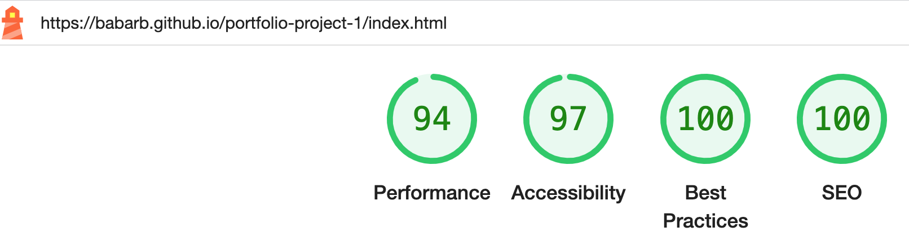
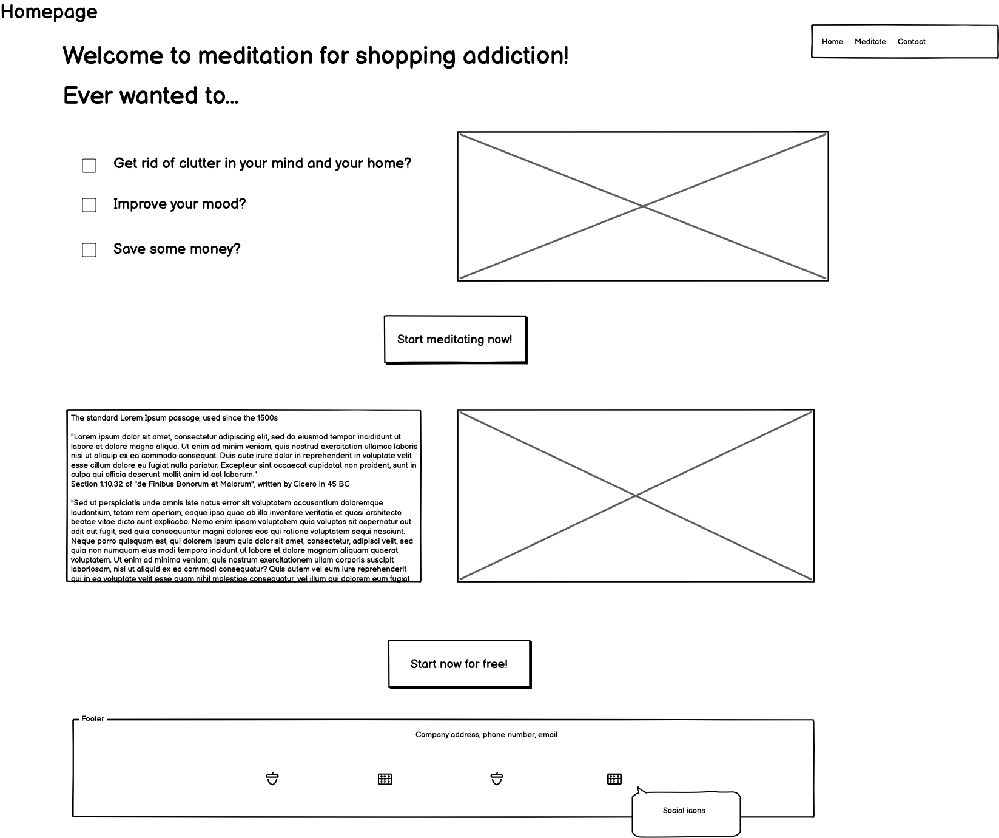
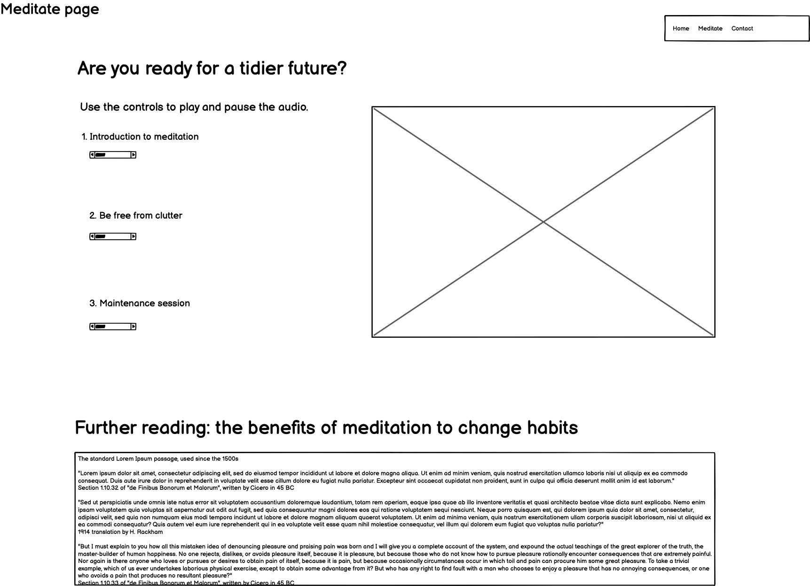
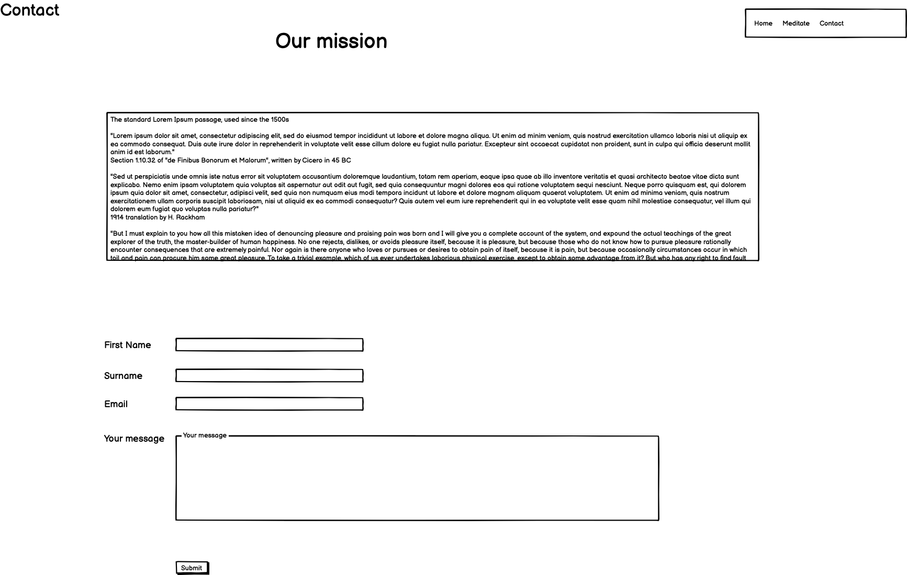

# Declutter!
  Todo https://ui.dev/amiresponsive
## Features

Declutter! is the first rough  version of a project I would like to extend in the future. The target audience is people with shopping addiction, to which the website offers meditation as a temporary solution. I have encountered people suffering from shopping addiction in my family and previous career. As regular meditator I strongly believe that this could be the answer for them.
The website was coded using the mobile fist principle: following coding for mobile, a media query was added laptop and larger screens. 
Due to time constrainsts I was aiming for a MVP. 

  
  ### Navigation bar
The navigation menu is inside the header. The site features a standard responsive navigation menu on the top right. On the top left, in line with user expectations, there is a site logo that navigates the visitor back to the home page.
A link redundancy (home as well as logo both redirect users to home) can be noted here, however this is often the case with websites, indluding the CI Walkthrough project. Because the average website visitor often encounters such redundancy, they will come to expect it. Considering the Stretegy Pane, such redundancy will positively impact the structure of the website and contribute to a better good user experience.
The active page is underlined to show the visitor where they are. The hovered menu items also change colour to a theme colour of the site. The navigation is consistent on all devices,and is responsive. One excention is the mobile, wher the toggling hamburger menu eliminates the need to underlined active pages.

### The Main Content
Due to the very specific audience of the site, the main page is not the landing page but the meditate page. Navigation from the home page to the meditate page is further facilitated by call to action buttons.

Across all pages, the main content consists of text on the left and an image on the right. It is not a background image as its purpose is to emphasize the message of the site.

### Further readings section
Repeating on both the landing and the meditate page for consistency, this is aimed at the user who is willling to scroll on, out of interest in further information or because of needing the meditation scripts.

### The Footer
This contains a basic contact details section. To comply with the European and German Data Protection regulation, this could be replaced by the Privacy Policy, the Cookie Policy, and the Impressum (for Germany). The law required that these areas are easy to find on websites. It is a UX best practice for these links to be in the footer.
Links to social media sites are located in the footer. For my own privacy, I used dummy links that open in a new window. The youtube channel, as I do not have one yet, points to my husband's channel as a temporary fix, in case the assessors of the site fancy listening to some good music.

### Page specific features

1. Index.html
   
   On the landing page, visitors will find information about meditation's ability to tackle shopping addiction. The first text is fairly short and uses a personal, question format to raise the immediate interest of those affected. If this resonates with them, they can click the call to action button straight away to land on the "Meditate" page. Undecisive visitors can read a text with further information, after which the same call to action button repeats for their convenience (i.e. to avoid having to scroll up again). This is another example of redundancy facilitating user experience, with the UX strategic pane impacting on the structural pane.

2. Meditate.html
   
   This is the main page of the website where the users can use the actual service. If for any reason the visitor prefers the sript, these can be downloaded as pdf or read directly in the browser.
    
    Consistency across the site is very iportant for good user experience. Therefore, this page has an identical structure with the home page: main text to the left, image to the right, further reading by scrolling down.
    Hearing impaired users, or those who prefer to read the text for themselves, are able to download the scripts of the files or read the scripts directly in the browser.
3. Contact.html

     This  has a simple contact form to enable visitors to contact the site owner by email.
??? Will it be like home and meditate???
Daisy best practice? New page on submitting contact form?

### Features left to implement

 1. Styled 404 page: this is important for both human visitors and browser bots to crawl the site correctly. Currently the 404 page is automatically provided by Github.
 2. User login: this requires a backend including a user database to check user credentials, and we have not reached this stage yet.
 3. Audio controls: the browser default audio controls are really basic and do not contribute to a good user experience Due to tme constrainst and focusing on the MVP, I decided to implement those and include short instructions for the user as a workaround. Current technologies offer better embedded audio players.

---
##  Deployment 

The project wass deployed to Github early, on day 2, in order to enable me to test it live, on various devices, and gain feedback on progress. It was also useful because the Code Anywhere IDE often had connection issues. Continuous deployment prevented the loss of data and served as a backup of my work. 
todo 3 parts here version control deployment repo gareth and credit

### Issues 

   I am aware that I tend to use the past participle in my commit messages. I continue working on developing thehabit of using the imperative mode instead. 

todo create table in markdown generator for test types
#### Functional testing
Next to brosser tools, testing was carried out on actual devices by other people. So the tablet view was tested on an ipad, and the mobile view on a phone. Reasons:
to give visitors of the site a real user experience, which leads to them sharing their first impressions. 
This helped me identify and eliminate the following issues
1. When viewing the site on an actual ipad, I noticed the main element shrinking. Further observations revealed that it was actually the header nav, and particularly the menu list items that are oversized. This could be easily eliminated in CSS:
   screenshot
   code

#### Lighthouse testing

This was carried out at a relatively early stage. 

#### Daisy testing

#### Form testing

#### Validator testing under the table w screenshots! wave!

## Credits

### Content

1. The following elements were created based on CI's Love Running tutorial:

    meta tags
    
    Formatting of the nav menu includibng the toggling of menu items with pure css

    Idea for footer social media link ul list
    
2. The contact form was made using the following site:
   

  
### Media

1. Favicon
  
    For the favicon i used Daisy McGirr's youtube video: https://www.youtube.com/watch?v=W809I-d9xTg 

    For generating the favicon used the following generator: https://favicon.io/favicon-generator/

2. For the pictures I used https://www.istockphoto.com/

3. For the initial draft texts, these were written by ChatGPT then rewritten by myself to sound more relevant and personal to the site's visitor.

4. etc

## Issues
1. Fix button issue: used this to make button: https://www.w3schools.com/howto/howto_css_center_button.asp
however the button did not open link in new window despite target _blank . The following website helped me fix this issue: https://medium.com/design-code-repository/a-vs-button-b859547cae4d

## Design
I created a basic wireframe, only for desktops. This served to give me a basic idea, leaving some room for modifications later.

There have been some deviations from this wireframe due to: 

* The learning process: I learnt about features along the way that I was not aware of at the time of creating the wireframe. E.g There are a lot more div wrappers than originally planned.

* some features worked better than initially planned from a user experience perspective. An example is the meditation texts and downloadable PDFs on the meditate page.

The site's colour scheme was changed multiple times to accommodate contrast ratios for better accessibility.

  

