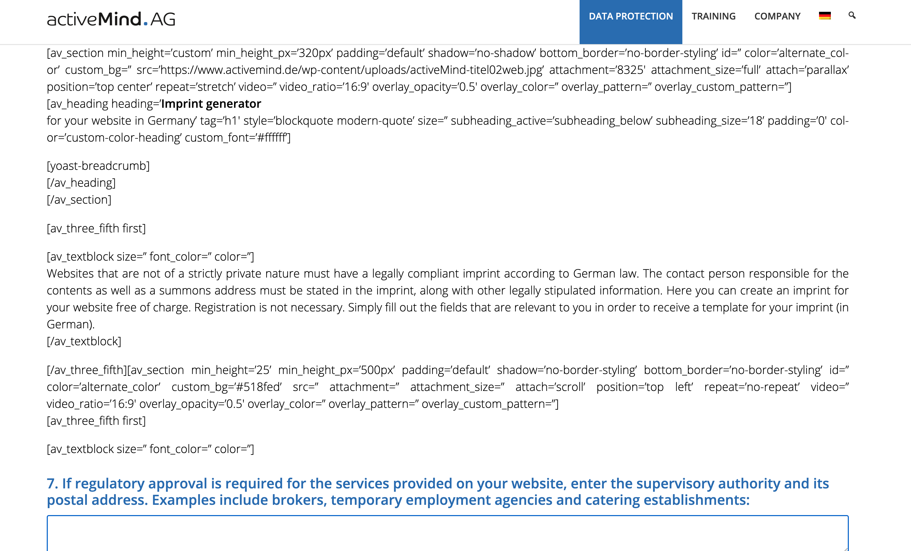

Declutter! is the first rough  version of a project I would like to extend in the future. The target audience is people with shopping addiction, to which the website offers meditation as a temporary solution. I have encountered people suffering from shopping addiction in my family and previous career. As regular meditator I strongly believe that this could be the answer for them.

*Features

**

***Navigation
The navigation menu is inside the header. The site features a standard responsive navigation menu on the top right. On the top left, in line with user expectations, there is a site logo that navigates the visitor back to the home page.
A link redundancy (home as well as logo both redirect users to home) can be noted here, however this is often the case with websites, indluding the CI Walkthrough project. Because the average website visitor, like me, often encounters such redundancy, they will come to expect it. Considering the Stretegy Pane, such redundancy will impact the structure of the website to contribute to a good user experience.

Due to the very specific audience of the site, the main page is not the landing page but the "meditate" page. Navigation to this page is further facilitated by call to action buttons.

***The Main Content
On the homepage, visitors will find information about meditation's ability to tackle shopping addiction. The first text is fairly short and uses a personal, question format to raise the immediate interest of those affected. If this resonates with them, they can click the call to action button straight away to land on the "Meditate" page. Undecisive visitors can read a text with further information, after which the same call to action button repeats for their convenience (i.e. to avoid having to scroll up again). This is another example of redundancy facilitating user experience, with the strategic pane impacting on the structural pane.

The hero image is placed to the right of the short into text to reinforce their point. It is not in the background, rather, visual summary of what the visitor may wish to achieve.  The logo and favicon serve a similar purpose: The one-word slogan with an exclamation mark promotes a result oriented approach as opposed to procrastination. This is in line with meditation's approach to stay in the present momet. "Declutter!" suggests: don't think about it, do it, and do it now.

***The Footer

Links to social media sites are located in the footer. For my own privary, I used dummy links that open in a new window. The youtube channel, as I do not have one yet, points to my husband's channel as a temporary fix, in case the assessors of the site fancy listening to some good music.

---

*Resurces:

Taken from love running tutorial:

meta tags
Formattting of the nav menu includibng the toggling of menu items with pure css

Idaa for footer social media link ul list, this was enhanced by myself

For the favicon i used Daisy McGirr's helpful youtube video https://www.youtube.com/watch?v=W809I-d9xTg I used the following generator: https://favicon.io/favicon-generator/

For the pictures I used https://www.istockphoto.com/

first deployment was in the early stages of the project when there was basic structure only., This was to practice deployment steps and bacause of the benefits of early deployment as discussed in the course material.

Fix button issue: used this to make button: https://www.w3schools.com/howto/howto_css_center_button.asp
however the button did not open link in new window despite target _blank . The following website helped me fix this issue: https://medium.com/design-code-repository/a-vs-button-b859547cae4d

I used ChatGPT to create the initial draft texts, these were then rewritten by myself to sound more relevant and personal to the site's visitor.

The meditation audios have been written by myself, the reader was Robert Tubb.

Testing (cross browser compatibility)
was carried out on actual devices by other people. So the tablet view was tested on an ipad, and the mobile view on a phone. Reasons:
- to give visitors of the site a real user experience, which leads to them sharing their first impressions
- because dev tools are not 100% reliable, browser compatibility playing a role in this. This statement has been verified by the user test. In tablet mode, the Firefox dev tools did not show the same errors as the Google dev tool. Therefore, it made sense to open the project on an actual tablet, and view it in both Firefox and Google Chrome. ???? For the purpose of this project, I only tested the project in the most popular browsers.???

